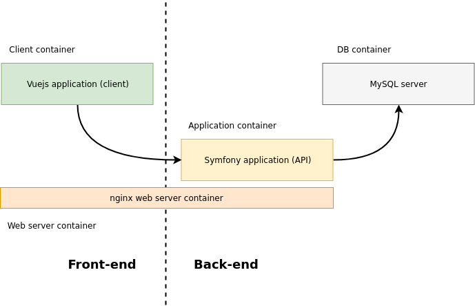

# Stellar

The end of earth will not be the end of us.

*Just another school project*

Architecture
------------

The application is made of a simple client to server architecture. See the schema below.

<p align="center"></p>

The server side use Api Platform, a powerful Symfony bundle to generate swagger documentation and default CRUD methods. The JWT component make authentication easier for the client side.

The usage of Docker allows us to deploy easily the application in a closed and secure environment.

Requirements
------------

  * PHP 7.1.3 or higher;
  * MySQL 5.7
  * PDO-MySQL PHP extension enabled;
  * Composer
  * npm & node **>= 8**
  * Docker **>= 18.0.0** & Docker-compose **>= 1.21.0**

Installation (docker)
------------

Execute these commands to install the project:

```bash
$ git clone https://github.com/SundownDEV/si7
$ cd si7/
$ docker-compose build
```

You can now browse the client at `http://localhost:3000/`

Installation (manual)
------------

Execute these commands to install the api :

```bash
$ git clone https://github.com/SundownDEV/si7
$ cd si7/server
$ composer install
$ bin/console doctrine:database:create
$ bin/console doctrine:schema:update  --force
$ bin/console server:start
```

Install and run the client

```
$ cd ../client
$ npm install
$ npm run dev
```

<hr>

Usage
-----

Create the database (manual installation only)

```
$ php bin/console doctrine:database:create
```

Update schema and install bundles assets

```bash
$ docker exec si7_app_1 bin/console doctrine:schema:update --force
$ docker exec si7_app_1 bin/console assets:install
```

Generate keys for authentication

```
$ openssl genrsa -out config/jwt/private.pem -aes256 4096
$ openssl rsa -pubout -in config/jwt/private.pem -out config/jwt/public.pem
```

In case your private key is encrypted and getting an error, you need to decrypt it first

```
$ openssl rsa -in config/jwt/private.pem -out config/jwt/private.pem
```

Built-in commands
-----

|     Description    | Command           |
| ------------- |:-------------|
| Install the project | `composer install && npm install`      |
| Start the server      | `php bin/console server:start` |
| Stop the server      | `php bin/console server:stop`      |
| Get the framework version      | `php bin/console app:version`      |
| List users      | `php bin/console app:list-users`      |
| Create new user      | `php bin/console app:add-user`      |
| Delete an user      | `php bin/console app:delete-user`      |
